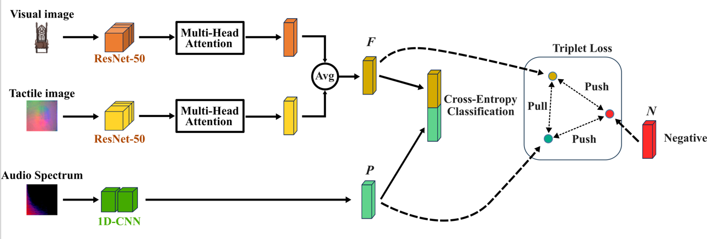

# VAT-CMR

This repository contains a Deep Neural Network (DNN) model designed for multimodal information retrieval. The model accepts three types of sensory input data: visual, auditory, and tactile.

- **Visual and Tactile Data**: Represented by RGB images (.png).
- **Auditory Data**: Stored as .wav files.

The full dataset is available [here](https://drive.google.com/drive/folders/1tUKbRt5QgVkjYPtqwllNBinv4hjf9rzW?usp=drive_link).

### Training Stages
1. **Initial Training**: The model is initially trained using a cross-entropy loss function. Each modality (visual, auditory, tactile) follows a separate pathway in the early layers. Specifically, we use a ResNet-50 architecture for image data and a 1D-CNN for audio data.
   
2. **Modal Fusion**: The separate pathways are then fused using a multihead attention mechanism to create a unified, bi-modal retrieval space.

3. **Feature Extraction**: The final stage involves extracting feature embeddings from the last hidden layers of the separate pathways. Using a triplet loss function, the model aims to bring the representations of the same objects in latent space closer together.



## Table of Contents

- [Installation](#installation)
- [Usage - Model Training & Cross-Retrieval Evaluation](#usage)
  - [Command-line Arguments](#command-line-arguments)
- [Experimental Results](#experimental-results)
  - [Dataset](#Dataset)
  - [Results](#Results)
- [License](#license)

## Installation

Clone the repository and install required prerequisites. 
Project was developed in Python 3.8.10, requirements.txt is provided.

```bash
git clone https://github.com/jagodawojcik/VAT-CMR.git
cd VAT-CMR
pip install -r requirements.txt
```

## Usage - Model Training & Cross-Retrieval Evaluation

Here's how to run the VAT-CMR model training with specifying minimum required parameters:

```bash
python main.py --query-modality QUERY_MODALITY --dominating-modality DOMINATING_MODALITY
```
The main.py function is designed such that the entire process of model training, and final model performance evaluation are run in a sequence. Produced model will be saved in a form of a .pth file, while the resulting feature embeddings are saved as .npy files. To allow ablation study, the embeddings are saved both when ran through the cross-entropy loss model, before and after fusion, as well as when processed through the final network.


### Command-line Arguments

#### `--query-modality`

*Required* Set the query modality:

- `visual`
- `audio`
- `tactile`

#### `--dominating-modality`

*Required* Set the dominating modality, representation of which will be used to compute cross-entropy loss. Joint embedding is a concatenated representation of all three modalities from the last layer of joint network.

- `visual`
- `audio`
- `tactile`
- `joint_embedding`

The following parameters, can also be specified, but are not required, default values are provided.

#### `--epoch-pretrain`

Set the number of epochs for tactile branch pretraining Default: `15`

#### `--epoch-c-entropy`

Set the number of epochs for the training with cross-entropy loss. Default: `50`

#### `--batch-size-c-entropy`

Set the batch size for the cross-entropy training stage - both pretrain and the main training stage. Default: `5`

#### `--epoch-triplet`

Set the max range of epochs for triplet loss training. Default: `19500`

#### `--batch-size-triplet`

Set the batch size for the triplet loss training stage. Default: `5`

#### `--margin-triplet`

Set the margin size for triplet loss optimization. Default: `0.5`

#### `--use-linux-echo`

Set logging type as True for Linux echo print or False for standard Python print. Default: `False`

## Experimental Results

A series of experiments were conducted, allowing us to investigate the proposed method. The VAT-CMR model performance was evaluated using Mean Average Precision metric, with the results of the final proposed method presented in the following subsections.


### Dataset
Link to dataset provided [here](https://drive.google.com/drive/folders/1tUKbRt5QgVkjYPtqwllNBinv4hjf9rzW?usp=drive_link).
Dataset used in a set of experiments conducted in VAT-CMR study consists of visual, audio and tactile representations of 20 objects, has the following distribution:

| Data Type       | Number of Images |
|-----------------|------------------|
| Total           | 34,500           |
*From which*:
| Training        | 25,500           |
| Validation      | 4,500            |
| Test & Evaluation | 4,500          |

Dataset was generated from ObjectFolder 2.0 created by R. Gao et al., code available here https://github.com/rhgao/ObjectFolder.

### Results 
Attention mechanism applied to fuse bi-modal representations. Tested across all modalities as dominant. 20 objects dataset = 0.05 random chance of retrieval.

| Query        | Retrieval    | Joint Embedding | Audio | Vision | Touch |
| ------------ | ------------ | --------------- | ----- | ------ | ----- |
| **Vision**       | **Touch + Audio** | 0.68            | 0.90  | 0.86   | 0.96  |
| Touch + Audio| Vision      | 0.71            | 0.78  | 0.82   | 0.85  |
| **Touch**        | **Vision + Audio**| 0.81          | 0.82  | 0.85   | 0.82  |
| Vision + Audio| Touch       | 0.69           | 0.77  | 0.93   | 0.90  |
| **Audio**        | **Vision + Touch**| 0.76          | 0.81  | 0.04   | 0.02  |
| Vision + Touch| Audio       | 0.81           | 0.94  | 0.06   | 0.08  |

## License

This project is licensed under the MIT License. For more details, see the [LICENSE](LICENSE) file in the repository.
